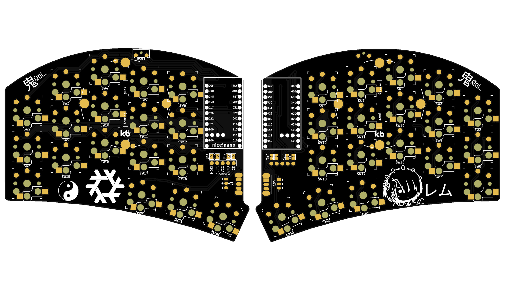
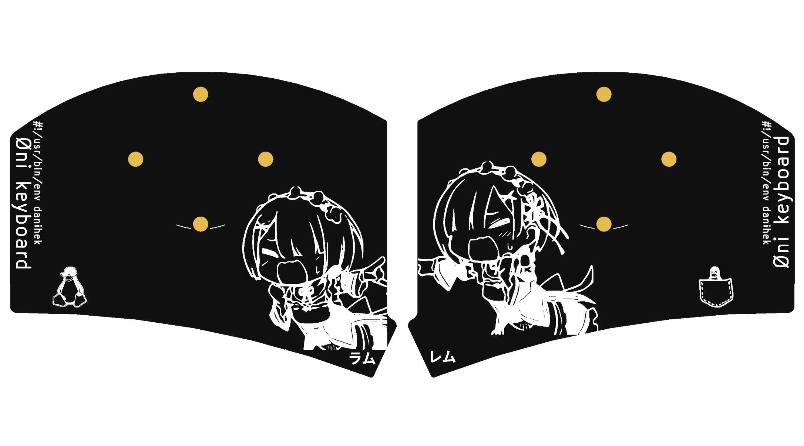

# Øni keyboard

It's just [sweep36](https://github.com/sadekbaroudi/sweep36/) (specifically swweeep) which is based on [Sweep](https://github.com/davidphilipbarr/Sweep) with custom images on pcb.

List of components:

- 2x [nice!nano v2.0](https://typeractive.xyz/products/nice-nano?variant=42225114546407)
- 4x [10x Kailh Low Profile Choc Pink](https://typeractive.xyz/products/choc-switches?variant=45741919273191)
- 4x [10x Kailh Choc Hotswap Sockets](https://typeractive.xyz/products/hotswap-sockets?variant=45742200324327)
- 1x [2x Power Switch](https://typeractive.xyz/products/power-switch?variant=45597854171367)
- 1x [2x Reset Button](https://typeractive.xyz/products/reset-button?variant=45597784932583)
- 4x [10x Kailh Hotswap Sockets](https://typeractive.xyz/products/hotswap-sockets?variant=45742200324327)
- 2x [Ez Solder Sockets and Headers](https://typeractive.xyz/products/ez-machine-sockets-and-headers?variant=46253860356327)
- 2x [10x MBK Choc Rose Keycaps](https://typeractive.xyz/products/mbk-keycaps?variant=48512019464423)
- 4x [10x MBK Choc Black Keycaps](https://typeractive.xyz/products/mbk-keycaps?variant=45419753079015)
- 2x [Battery 3.7V 110mAh 301230](https://typeractive.xyz/products/lithium-battery-110mah)

# Firmware

I use it with the zmk, here is the conf:
- https://github.com/danihek/oni-keyboard-zmk

# Showcase

## reddit post:
- https://www.reddit.com/r/ErgoMechKeyboards/comments/1ibfym8/oni_keyboard_sweep36/

(images from reddit)

## from JLCPCB Gerber viewer

### Main PCB

### Base (optional)

